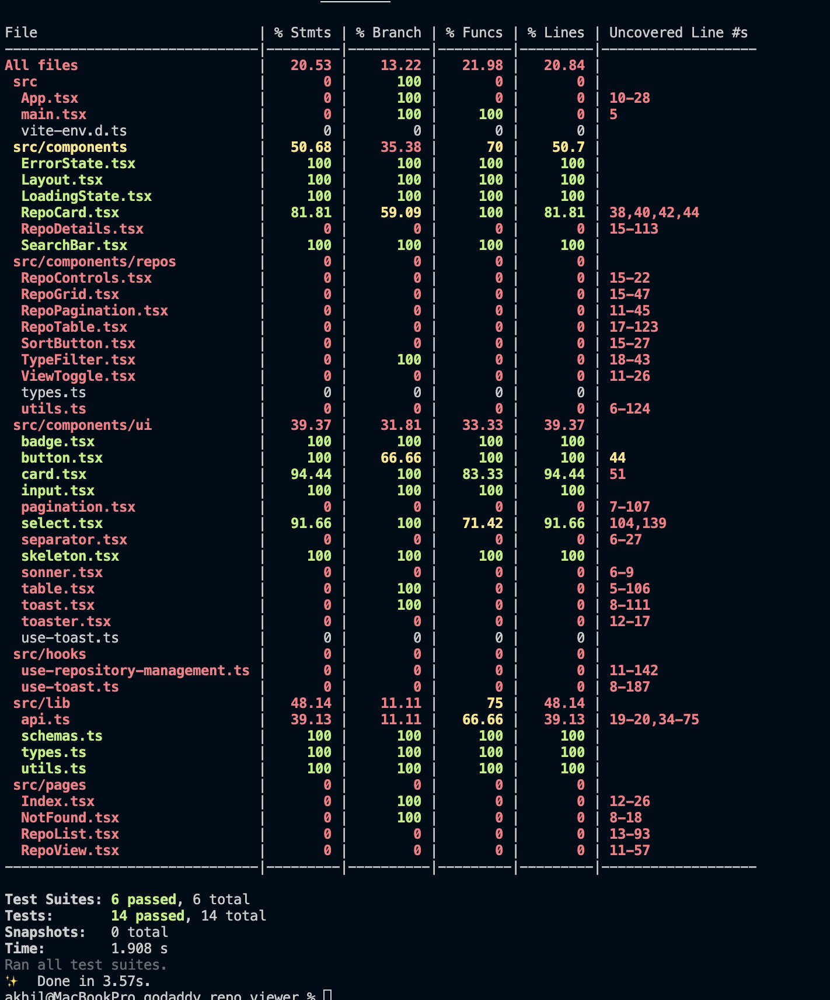

# GoDaddy Repo Viewer

A tool designed to view and manage repositories associated with GoDaddy. This project provides a clean and intuitive interface for quickly navigating through repository details, filtering repositories, and managing your favorites.

## Overview

GoDaddy Repo Viewer lets users:
- **List Repositories:** Retrieve and display GoDaddy-related repositories from GitHub.
- **View Details:** Dive into key repository information such as status and configuration.
- **Filter Repositories:** Apply filters based on stars, forks, watchers, etc.
- **Manage Favorites:** Mark and store your favorite repositories locally for easy access.

Built with simplicity and ease-of-use in mind, this project leverages well-supported libraries to ensure a reliable and maintainable codebase.

## Features

- **Repository Listing:** Quickly display a comprehensive list of repositories.
- **Detailed Views:** Examine in-depth details for each repository.
- **Intuitive Filtering:** Filter repositories by parameters like number of stars, forks, and watchers.
- **Favorites Management:** Save and manage a list of favorite repositories using local storage.
- **Keyboard Navigation and A11y compatible** Navigate using tab and keybard and A11y WCAG2.0 complaint.
- **Mobile Friendly Design:** 

## Built With

This project is built using modern web development technologies:

- **Vite:** A fast development build tool.
- **TypeScript:** Provides static typing for more robust code.
- **React:** Powers the dynamic and responsive user interface.
- **shadcn-ui:** Offers pre-built, customizable UI components.
- **Tailwind CSS:** Enables rapid, utility-first CSS styling.
- **Zod:** Ensures runtime schema validation.
- **React Query:** Handles efficient data fetching and caching.
- **Lucid Icons:** Supplies a comprehensive set of icons.

# Specification: React-QUery vs. Relay

 - ** Bundle Size:** Since this App was extremely small, REST API + React Query is the choice because React Query is much smaller than Relay. 

# Specification: Pagination vs. Infinite Scroll

**Context:**  
Choosing between pagination and infinite scroll for displaying content affects user experience, performance, and accessibility.

## Reasons Why Pagination is a Better Design Choice

### 1. Controlled Content Consumption
- **Pagination:** Users have clear visibility of content volume, page count, and their current position, which supports easy navigation and orientation.
- **Infinite Scroll:** Users lose awareness of total content size, potentially leading to disorientation or fatigue.

### 2. Improved Performance
- **Pagination:** Loads content incrementally with explicit user actions, reducing initial load time and server load.
- **Infinite Scroll:** Can overload resources, leading to slower performance and excessive memory usage over prolonged browsing.

### 3. Accessibility
- **Pagination:** Better supports screen readers and keyboard navigation by offering structured, clearly labeled navigation controls.
- **Infinite Scroll:** Less accessible to keyboard-only users or assistive technologies due to continuous loading of new content without clear boundaries.

### 4. Enhanced Usability
- **Pagination:** Users can easily return to previous content or bookmark specific pages.
- **Infinite Scroll:** Difficult to revisit content or remember scroll positions, especially after extensive browsing.

### 5. SEO-friendly
- **Pagination:** Easier for search engines to index distinct pages and content groups.
- **Infinite Scroll:** Can complicate indexing, affecting visibility in search engine results.

### 6. Analytics and Metrics
- **Pagination:** Allows precise tracking of user interactions, navigation paths, and page-specific metrics.
- **Infinite Scroll:** Makes it difficult to accurately measure engagement and content effectiveness.

## Conclusion
Pagination offers superior user control, clarity, accessibility, performance, and analytics tracking, making it a preferable choice in scenarios where structured navigation and user orientation are prioritized.

## LightHouse Score 


## Test Coverage


## Demo
[Walkthrough[(https://www.loom.com/share/324d7c6926ba437786a929fa3ab08e62?sid=759fbd07-e61d-4305-9fa8-7ea3327f0b50)

## Installation

Follow these steps to set up the project locally:

1. **Clone the Repository:**

   ```bash
   git clone https://github.com/akhilbharti/godaddy_repo_viewer.git
   cd godaddy_repo_viewer
    ```
   
2. Install dependencies

   ```bash
   yarn
   ```

3. Fire up the server and watch files

   ```bash
   yarn start
   ```

**Given more time I would Implement the following.

- Add a better Error Page.
- Increased Testing Code Coverage.
- Add custom error UIs.
- Add the support for internationalisation react-intl.
-Update linting rules from godaddy javascript styling guides.
- Add pre-flight step github action for test, lint etc.
-Depending on production setup I would containerise this application to quickly scale it.
- Gather coverage and add badges Coveralls etc.
- If there should be more routes, we can lazy load them.
- Make use of ui-kit for ShadCn added custom theme theme.
- Any other unclear decisions can be discussed in a follow-up.

